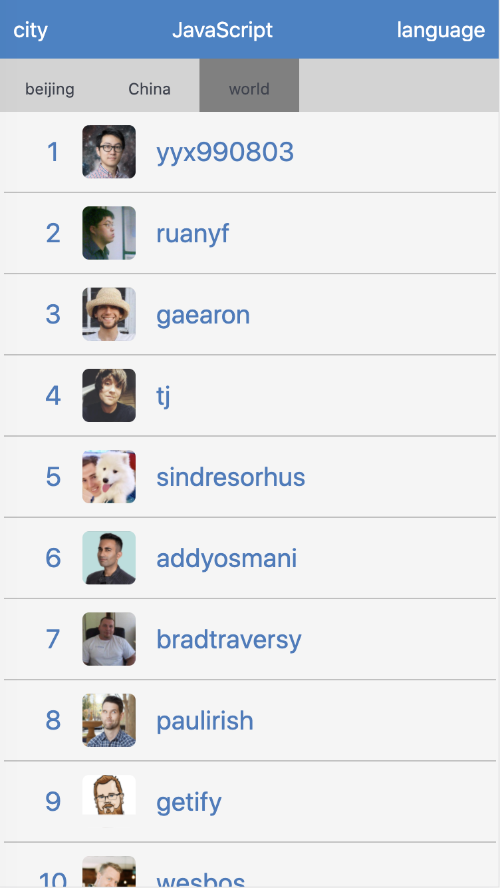
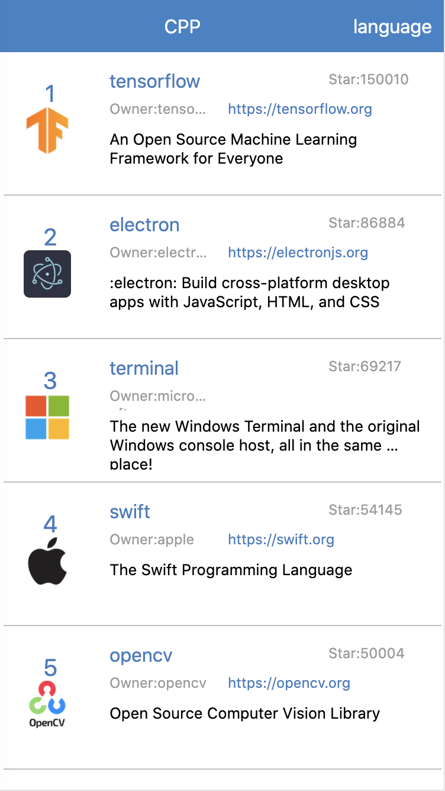
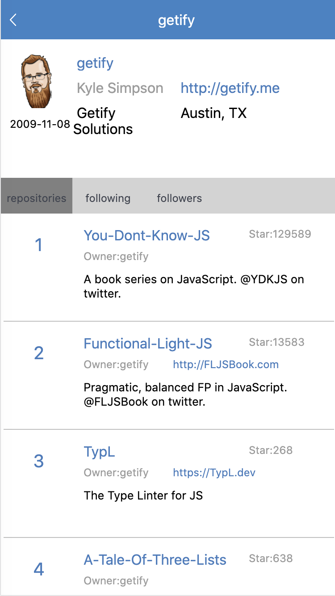
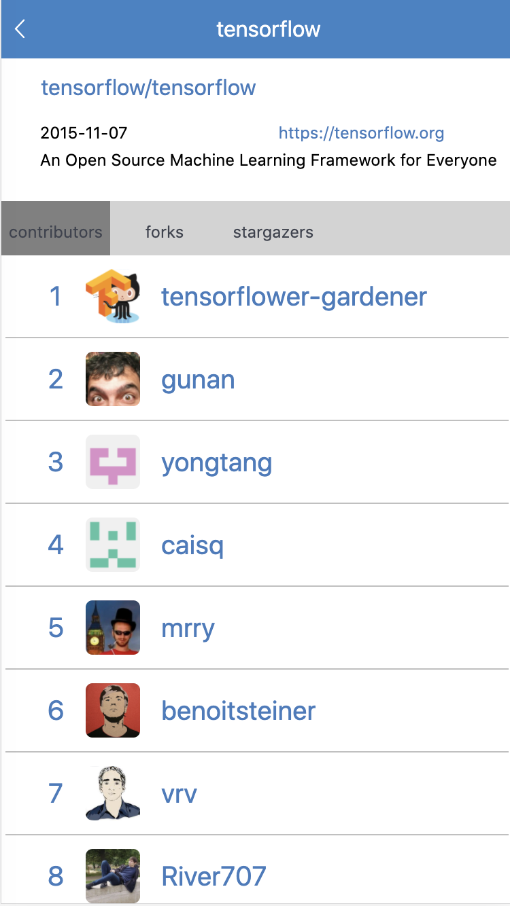

Monkey是一个可以展示GitHub上开发者、仓库排名的应用

weex环境安装参考[官方文档](https://weex.apache.org/zh/guide/develop/setup-develop-environment.html#%E8%AE%BE%E7%BD%AE%E5%BC%80%E5%8F%91%E7%8E%AF%E5%A2%83)

安装依赖

```
npm install
```

开启Web服务

```
npm start
```

运行

```
weex run ios
weex run android
weex run web
```





